# Parkbench — DuckLake Streaming Benchmark Tool

A Go CLI that benchmarks data insertion performance into a DuckLake catalog. Supports two metadata store backends: **PostgreSQL** (default) or **DuckDB** (no Postgres required).



## Quick Install

Download and run the installer script in one command:

```bash
curl -fsSL https://raw.githubusercontent.com/early-signal-tech/parkbench/main/install.sh | bash
```

**Or with a specific version:**

```bash
curl -fsSL https://raw.githubusercontent.com/early-signal-tech/parkbench/main/install.sh | bash -s v1.0.0
```

**Or to a custom location:**

```bash
curl -fsSL https://raw.githubusercontent.com/early-signal-tech/parkbench/main/install.sh | bash -s latest /opt/parkbench
```

The installer will:

- Detect your OS and architecture automatically
- Download the latest binary from GitHub releases
- Install to `/usr/local/bin/parkbench` (or your custom path)
- Verify the installation works

## Manual Installation

**macOS (Apple Silicon / ARM64):**
```bash
curl -L https://github.com/early-signal-tech/parkbench/releases/download/v1.0.0/parkbench-darwin-arm64 | sudo install -m 755 /dev/stdin /usr/local/bin/parkbench
parkbench --help
```

**macOS (Intel / AMD64):**
```bash
curl -L https://github.com/early-signal-tech/parkbench/releases/download/v1.0.0/parkbench-darwin-amd64 | sudo install -m 755 /dev/stdin /usr/local/bin/parkbench
parkbench --help
```

**Windows (AMD64) - PowerShell (Admin):**
```powershell
$url = "https://github.com/early-signal-tech/parkbench/releases/download/v1.0.0/parkbench-windows-amd64.exe"
$installPath = "$env:ProgramFiles\parkbench\parkbench.exe"
New-Item -ItemType Directory -Force -Path "$env:ProgramFiles\parkbench" | Out-Null
[Net.ServicePointManager]::SecurityProtocol = [Net.SecurityProtocolType]::Tls12
Invoke-WebRequest -Uri $url -OutFile $installPath
$env:Path += ";$env:ProgramFiles\parkbench"
[Environment]::SetEnvironmentVariable("Path", $env:Path, [EnvironmentVariableTarget]::User)
parkbench --help
```

## Quick Start

### DuckDB metadata store (no Postgres required)

```bash
# Setup catalog (creates ./ducklake_data/wh.ducklake)
parkbench setup --metadata-store duckdb

# Run benchmarks
parkbench run --metadata-store duckdb

# Reset and start fresh
parkbench reset --metadata-store duckdb --force
```

### Postgres metadata store (default)

```bash
# Prerequisites: Postgres must be running with the catalog database created
brew services start postgresql@18
psql -d postgres -c "CREATE DATABASE ducklake_v1;"

# Setup catalog
parkbench setup

# Run benchmarks
parkbench run

# Reset and start fresh
parkbench reset --force
```

## Metadata Store Backends

The `--metadata-store` flag is available on all commands (`setup`, `run`, `reset`).

| Backend | Flag | Metadata location | Parquet data |
|---------|------|-------------------|--------------|
| `postgres` (default) | `--metadata-store postgres` | PostgreSQL database | `./ducklake_data/` |
| `duckdb` | `--metadata-store duckdb` | `./ducklake_data/wh.ducklake` | `./ducklake_data/` |

Use `--data-path` and `--catalog` to customize both the catalog file location and Parquet data directory.

## Commands

### `setup` — Initialize a DuckLake catalog

Creates the `events`, `events_rich`, and `events_rejected` tables in the catalog.

```bash
parkbench setup
parkbench setup --metadata-store duckdb
parkbench setup --metadata-store postgres --pg-dsn "dbname=ducklake_v1 host=localhost" --data-path "./ducklake_data" --catalog wh
```

**Flags:**

| Flag | Default | Description |
|------|---------|-------------|
| `--catalog`, `-c` | `wh` | Catalog alias used inside DuckDB SQL |
| `--metadata-store` | `postgres` | Metadata store backend: `postgres` or `duckdb` |
| `--pg-dsn` | `dbname=ducklake_v1 host=localhost` | Postgres DSN (postgres mode only) |
| `--data-path` | `./ducklake_data` | Directory where Parquet files are written |

### `run` — Benchmark insertion

Inserts rows continuously and prints throughput stats.

```bash
# Batch mode, simple schema (default)
parkbench run

# DuckDB metadata store
parkbench run --metadata-store duckdb

# Rich schema
parkbench run --mode rich

# Ticker mode (1 row/sec for 60s)
parkbench run --run-mode ticker --duration 60

# Ticker mode with 15% duplicate injection
parkbench run --run-mode ticker --duration 60 --duplicate-rate 0.15

# Ticker mode with 20% schema drift
parkbench run --run-mode ticker --duration 60 --schema-drift-rate 0.20

# Run forever
parkbench run --num-batches 0
```

**Flags:**

| Flag | Default | Description |
|------|---------|-------------|
| `--catalog`, `-c` | `wh` | Catalog alias |
| `--metadata-store` | `postgres` | Metadata store backend: `postgres` or `duckdb` |
| `--pg-dsn` | `dbname=ducklake_v1 host=localhost` | Postgres DSN (postgres mode only) |
| `--data-path` | `./ducklake_data` | Parquet data directory |
| `--mode`, `-m` | `simple` | Schema mode: `simple` or `rich` |
| `--run-mode`, `-r` | `batch` | Run mode: `batch` or `ticker` |
| `--table`, `-t` | _(auto)_ | Table name (defaults to `events` or `events_rich`) |
| `--batch-size`, `-b` | `100000` | Rows per batch (batch mode only) |
| `--num-batches`, `-n` | `10` | Number of batches; `0` = run forever |
| `--flush-interval`, `-k` | `10` | Flush inlined rows to Parquet every N batches (batch mode) or at end if inlined rows > N (ticker mode); `0` = never |
| `--duration`, `-d` | `60` | Duration in seconds (ticker mode only) |
| `--duplicate-rate` | `0.0` | Probability (0.0–1.0) of injecting a duplicate row each tick (ticker mode only) |
| `--schema-drift-rate` | `0.0` | Probability (0.0–1.0) of injecting a schema-breaking row each tick (ticker mode only) |

### `reset` — Drop and recreate the catalog

Wipes all data and re-runs `setup`. For Postgres mode, drops and recreates the database via `psql`. For DuckDB mode, deletes the `.ducklake` catalog file.

```bash
parkbench reset               # prompts "yes" to confirm (postgres)
parkbench reset --force       # skip confirmation (postgres)
parkbench reset --metadata-store duckdb --force
```

**Flags:**

| Flag | Default | Description |
|------|---------|-------------|
| `--catalog`, `-c` | `wh` | Catalog alias |
| `--metadata-store` | `postgres` | Metadata store backend: `postgres` or `duckdb` |
| `--pg-dsn` | `dbname=ducklake_v1 host=localhost` | Postgres DSN (postgres mode only) |
| `--data-path` | `./ducklake_data` | Parquet data directory to remove |
| `--force`, `-f` | `false` | Skip confirmation prompt |

## Querying from DuckDB CLI

Run `duckdb` from the same working directory used by `parkbench run`, then:

### Postgres-backed catalog

```sql
INSTALL ducklake;
LOAD ducklake;
ATTACH 'ducklake:postgres:dbname=ducklake_v1 host=localhost' AS wh
  (DATA_PATH './ducklake_data', AUTOMATIC_MIGRATION TRUE);

SELECT COUNT(*) FROM wh.events;
SELECT * FROM wh.events LIMIT 10;
```

### DuckDB-backed catalog

```sql
INSTALL ducklake;
LOAD ducklake;
ATTACH 'ducklake:duckdb:./ducklake_data/wh.ducklake' AS wh
  (DATA_PATH './ducklake_data', AUTOMATIC_MIGRATION TRUE);

SELECT COUNT(*) FROM wh.events;
SELECT * FROM wh.events LIMIT 10;
```

### Useful queries

```sql
-- Check schema-drift rejections
SELECT COUNT(*) FROM wh.events_rejected WHERE anomaly_type = 'schema_drift';
SELECT * FROM wh.events_rejected ORDER BY rejected_at DESC LIMIT 10;

-- Check DuckLake settings
SELECT * FROM ducklake_settings('wh');
```

## Schema Modes

**simple** — `wh.events`
```sql
id INTEGER, ts TIMESTAMP, event_type VARCHAR
```

**rich** — `wh.events_rich`
```sql
id INTEGER, user_id VARCHAR, event_type VARCHAR, ts TIMESTAMP, payload JSON, metadata JSON
```

**rejected (dead letter)** — `wh.events_rejected`
```sql
rejected_at TIMESTAMP, source_table VARCHAR, anomaly_type VARCHAR,
attempted_id INTEGER, error_message VARCHAR, payload JSON
```

## Building

```bash
go build -o parkbench .
```

## Requirements

- Go 1.24.0+
- DuckDB via `github.com/duckdb/duckdb-go/v2`
- PostgreSQL (only for `--metadata-store postgres`)

## Development

The tool uses:
- `github.com/spf13/cobra` for CLI framework
- `github.com/duckdb/duckdb-go/v2` for database access

Data is inserted using randomized SQL generation from predefined vocabularies:
- Event types: click, view, purchase, signup, logout, search, share
- Pages: /home, /product, /cart, /checkout, /profile, /search, /settings
- Sources: web, mobile, api, email, push
- Countries: US, GB, DE, FR, JP, CA, AU, BR
